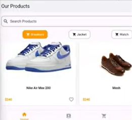
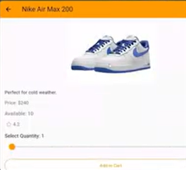
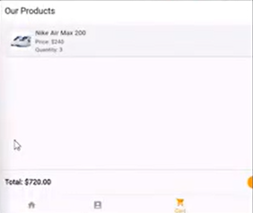
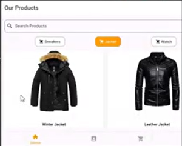

# 🛍️ Flutter E-Commerce App

## 📌 Overview
The **Flutter E-Commerce App** is a mobile application designed to simulate a real online shopping experience.  
It allows users to **browse products, add them to favorites or a cart, manage their profile, and proceed to checkout**.  
The app is fully built using **Flutter SDK** with a clean and responsive UI.

---

## 🚀 Features
- 🏷 **Product Listing:** Browse products by category (Sneakers, Jackets, Watches).
- ❤️ **Favorites Management:** Add or remove products from the favorites list.
- 🛒 **Shopping Cart:** Add or remove products, calculate total price, and proceed to checkout.
- 👤 **User Profile:** Display user information with a clean and minimal UI.
- 📄 **Product Details:** View product info, select quantity, and add items to the cart.

---

## ⚙️ Core Functionalities

### 1️⃣ Product Page
- Display products in a grid view filtered by category.
- Search bar to find products easily.
- Toggle favorite icon (❤️) to save products.
- Navigate to **Product Details** on tap.

### 2️⃣ Favorites Page
- Display all saved favorite products.
- Remove products individually (❌ button).
- Show "No favorite products yet!" when empty.

### 3️⃣ Cart Page
- List all added products with their prices.
- Delete products from the cart (🗑️ icon).
- Calculate **total amount dynamically**.
- Simple checkout form (Card number, Expiry date, CVV).

### 4️⃣ Profile Page
- Display **user picture, name, email, phone, address, and birthdate**.
- Simple and elegant design with **light orange background**.

### 5️⃣ Product Details Page
- Show product image, description, rating, and price.
- Quantity selector using **Slider widget**.
- **"Add to Cart" button** for direct purchase.

---

## 🛠 Tech Stack
- **Flutter SDK** (Dart language)
- **Material Design Components**
- **Stateful Widgets** for state management
- **Navigation & Routing** between pages
- **Git & GitHub** for version control

---

## 📸 Screenshots

---

## 📂 Project Structure
